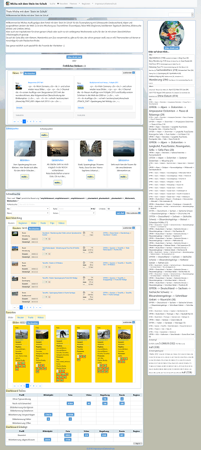

# MyTourbook-Electron-App

MyTourbook-Electron-App is a electron-application for managing and publishing tracks and images from your trips.
It's the software-stack behind the new portal-version [www.michas-ausflugstipps.de](http://www.michas-ausflugstipps.de/mytb/de/).
It's based on mytourbook and mysimplehomepage-electron.

**But be aware: it start's a local server with default-passwords!!!!!**

For more information take a look at documentation:
- [portalinfo](docs/INFO.md)
- [changelog](docs/CHANGELOG.md) 
- [installation/run instructions](docs/INSTALL.md)
- [configuration instructions](docs/CONFIGURATION.md)
- [credits for used libraries](docs/CREDITS.md)

